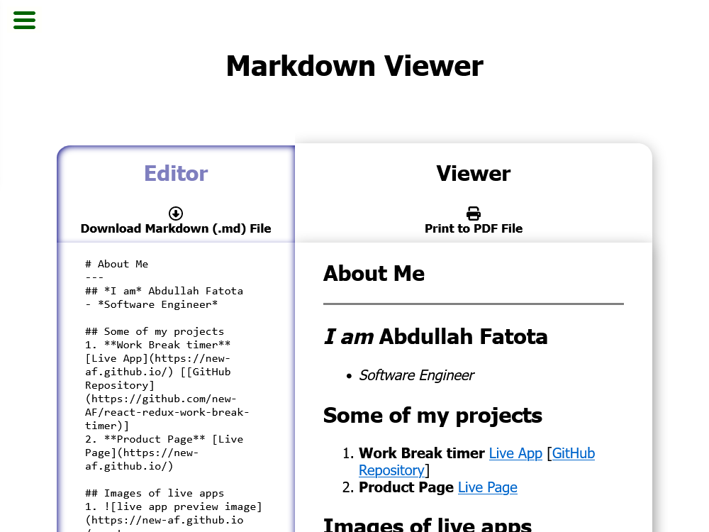

<h1 align="center">Markdown Viewer</h1>

  

    <strong style="margin: 2rem 0;">Render plaintext Markdown input to styled and formatted output as you type</strong>
  

  

  

  

  

## Supported features

-   Save rendered Output as PDF file through Browser's Print Dialogue.
-   Download Input as plaintext `.md` file.

### Supported Markdown features include

-   Headers
-   Unhighlighted Inline Code Snippets
-   Highlighted Code Blocks
-   Links, Ordered and Unordered lists
-   Linked Images

## Run the App Online

**[Run the App Online (hosted by GitHub Pages!)](https://new-af.github.io/react-markown-previewer/)**

## Install and Run Locally

_Note I use `pnpm` as javascript packages manager, but `npm` should work too._

`git clone https://github.com/new-AF/react-markown-previewer.git`

`cd react-markown-previewer`

`pnpm install`

`pnpm run dev`

## App Preview

